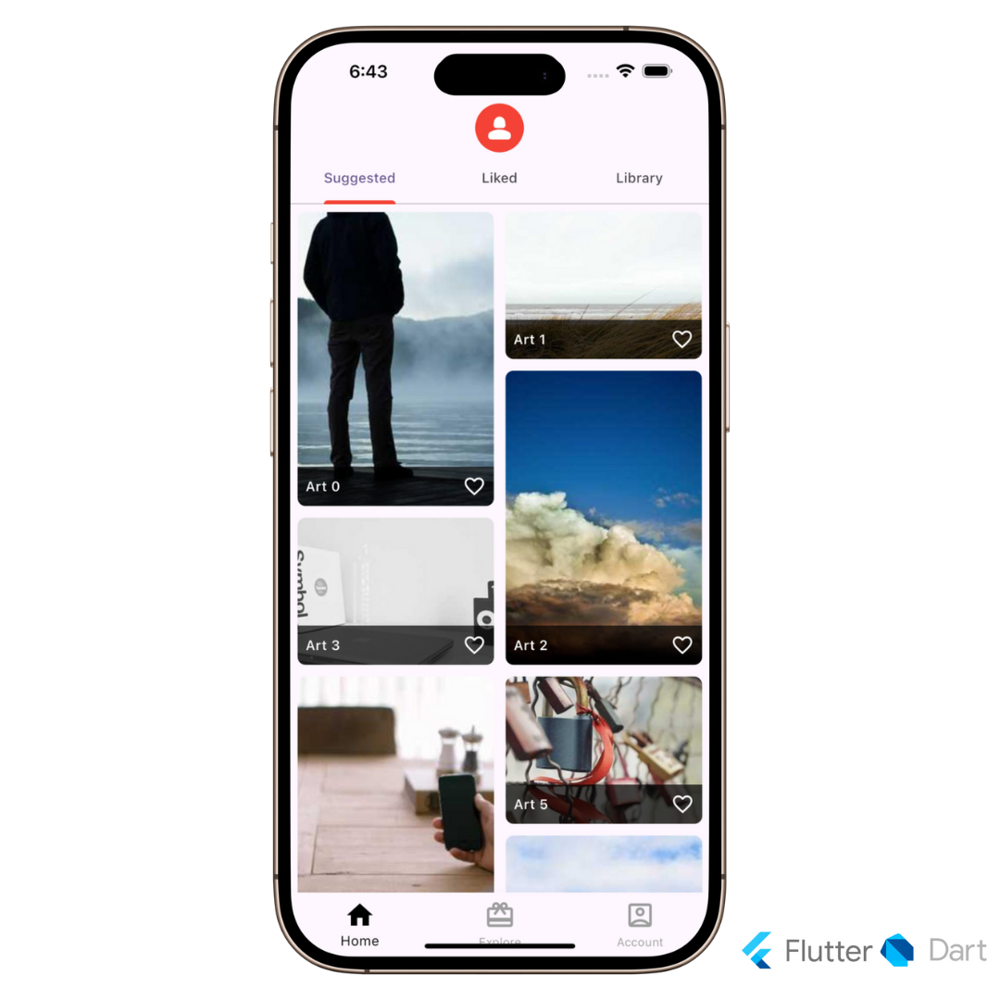

# Panels - Flutter Wallpaper App

A modern wallpaper application built with Flutter that allows users to browse and set beautiful wallpapers on their devices.

## Features

- 🖼️ Clean and intuitive user interface
- 🔍 Browse through various wallpaper collections
- 📱 Smooth image loading and caching
- 🎨 Material Design 3 implementation

## Screenshots



## Getting Started

### Prerequisites

- Flutter SDK (latest stable version)
- Android Studio / VS Code
- Git

### Installation

1. Clone the repository
```bash
git clone https://github.com/siraajul/panels.git
```

2. Navigate to the project directory
```bash
cd panels
```

3. Install dependencies
```bash
flutter pub get
```

4. Run the app
```bash
flutter run
```

## Project Structure

```
lib/
  ├── pages/         # UI screens
  ├── widgets/       # Reusable widgets
  └── main.dart      # Entry point
```

## Tech Stack

- Flutter
- Cached Network Image

## Current Status

The application is currently in development with the following features implemented:
- Base UI implementation
- Image loading and caching system

## Upcoming Features

- [ ] Wallpaper categories
- [ ] Search functionality
- [ ] Save wallpapers locally
- [ ] Set wallpaper functionality
- [ ] User favorites
- [ ] Dark/Light theme support

## Contributing

Contributions are welcome! Please feel free to submit a Pull Request.

## License

This project is licensed under the MIT License - see the [LICENSE](LICENSE) file for details.

## Acknowledgments

- [MKBHD Panels App]

## Contact

Your Name - [@siraaajul](https://twitter.com/siraaajul)

Project Link: [https://github.com/siraajul/panels](https://github.com/siraajul/panels)